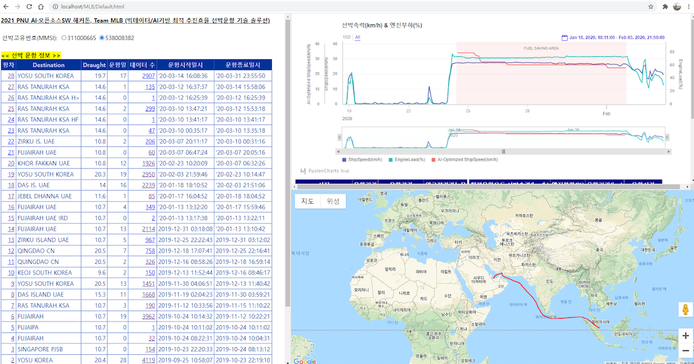

# 빅데이터/AI 기반 최적 추진효율 선박운항 기술 개발  

## 필요 환경
- python 3.x 버전
- 패키지
  requirements.txt를 사용해서 설치  
  패키지 설치 방법 : `pip install -r requirements.txt` 
  
## 실행 방법
python execute.py [인자] [값]  
예시)  
```bash
python execute.py \
    -f ./data/AIS_data \
    -tr ./data/AI_train_data/538008382_SmartShipData_forAI.csv \
    -x ./web/XML \
    -j ./web/JSON \
    -db ./web/DB \
    -ai ./web/AI_result/RMSE.csv \
    -v True
```
### 실행 인자 설명
- -f, --data_folder : AIS 데이터 폴더
- -tr, --ai_train : AI 학습을 위한 SmartShip 데이터
- -x, --xml_folder : Google map 연동을 선박의 위한 위도 경도 데이터
- -j, --json_folder : 선박의 속도를 그래프로 그려줄 데이터
- -db, --database : 선박의 운항 정보 데이터베이스
- -ai, --ai_result : AI 모델 학습 결과를 출력할 csv 파일 경로
- --SH_mmsi : SmartShip 데이터로 활용할 선박 고유 ID
- --SH_data : SmartShip 데이터 경로
- -v, --verbose : 실행 과정 출력
  
### 데이터 경로
- AIS data  
AIS데이터는 선박별로 폴더를 만들어서 excel 파일을 넣어주면 폴더별로 정리하여 데이터를 분석  
예)  
./data/AIS_data/{선박1}/{데이터...}  
./data/AIS_data/{선박2}/{데이터...}  
- SmartShip data  
SmartShip 데이터로 csv 파일  
- AI train data  
SmartShip 데이터 중에서 학습에 사용할 데이터만 선택된 csv 파일  
  
### 결과 파일
- xml 파일  
Google map에 표시할 선박의 좌표를 저장한 데이터  
- json 파일  
선박의 속력과 엔진 부하를 표로 보여줄 데이터  
- database 파일  
선박의 항차별 운행 정보를 정리한 데이터  
- AI model result 파일  
선박 속력을 예측하기위해 실험한 AI 모델들의 결과를 저장한 데이터  
